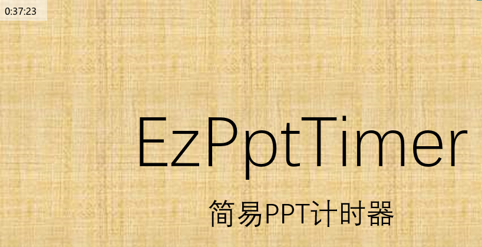
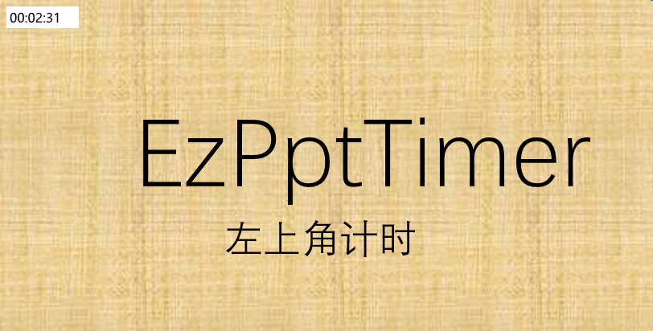

# EzPptTimer

简单的计时工具，可用于PPT计时。

## 贡献者指南

本项目欢迎各种建议和贡献。

### Contributers

Made with [contrib.rocks](https://contrib.rocks).

### Code of Conduct

本项目实行[No Code of Conduct](CODE_OF_CONDUCT.md): 我们欢迎任何贡献,别的都不重要。详见[Code of Conduct](CODE_OF_CONDUCT.md)

### Contribution requirements

请保证您的代码符合本项目的开源协议,详见[Developer Certificate of Origin](CODE_OF_CONDUCT.md)。

## 引用

本项目使用了以下开源软件:

| 项目                                        | 许可  | 备注 |
| ----------------------------------------- | --- | --- |
| [Dear ImGui](https://github.com/ocornut/imgui) | [MIT](https://mit-license.org/) | |
| [glfw](https://www.glfw.org/) | [Zlib OR Libpng](https://www.glfw.org/license) | |
| [辉光管图片 by Richard Štefún](https://www.pexels.com/photo/2024-alarm-clock-arduino-clock-1069690/) | [Pexels](https://www.pexels.com/license/) | 作为程序图标 |

<!--
同时本项目在开发过程中离不开以下软件的支持:

- Mingw-w64
- Msys2
- Clangd
- UPX
-->

## 版权与许可

Copyright 2022 Winterreisender.  
Licensed under GNU Affero General Public License Version 3.

SPDX-License-Identifier: **AGPL-3.0-only**

This program is free software: you can redistribute it and/or modify it under the terms of the GNU Affero General Public License as published by the Free Software Foundation, only version 3 of the License.  
This program is distributed in the hope that it will be useful, but WITHOUT ANY WARRANTY; without even the implied warranty of MERCHANTABILITY or FITNESS FOR A PARTICULAR PURPOSE. See the GNU Affero General Public License for more details.  
You should have received a copy of the GNU Affero General Public License along with this program. If not, see <https://www.gnu.org/licenses/>.

本程序是自由软件：你可以再分发之和/或依照由自由软件基金会发布的 GNU Affero通用公共许可证修改之，仅版本 3 许可证。  
发布该程序是希望它能有用，但是并无保障;甚至连可销售和符合某个特定的目的都不保证。请参看 GNU Affero通用公共许可证，了解详情。  
你应该随程序获得一份 GNU Affero通用公共许可证的复本。如果没有，请看 <https://www.gnu.org/licenses/>。

